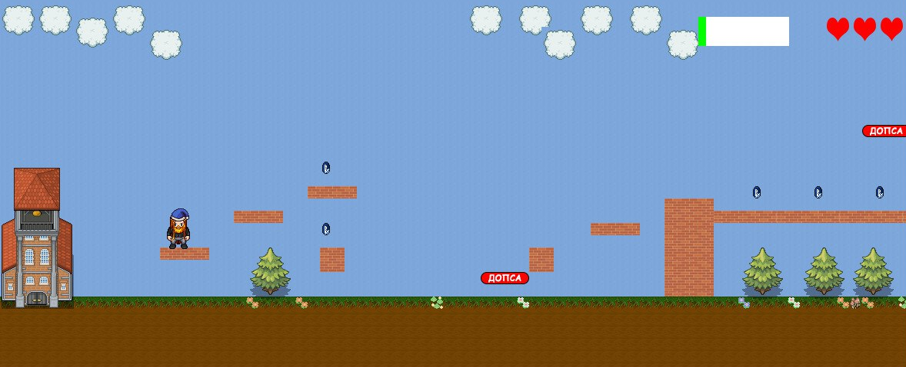

# SuperHSE

<p align="center">
    
</p>

### Краткое полу-техническое описание проекта

Это игра-платформер со стилизацией под НИУ ВШЭ СПб в виде десктопного приложения под Linux. В игре пользователю предложено пройти несколько уровней; в процессе прохождения можно собирать виртуальную валюту – монетки ВШЭ – которая может быть использована для приобретения дополнительных “жизней" (или доступа к дополнительным уровням и скинам (soon)). Помимо этого на каждом уровне встречаются враги - их нужно либо перепрыгнуть, либо уничтожить, прыгнув сверху. 

Также в игре скоро будет поддерживаться прохождение некоторых уровней совместно с другим игроком (мультиплеер) и локальное сохранение прогресса пользователя по каждому уровню (лучшее время прохождения и количество собранных монет).




## Зависимости 

- SFML - команда для установки:
```
sudo apt-get install libsfml-dev
```

- SQLite3 - команда для установки:
```
sudo apt-get install sqlite3 libsqlite3-dev
```

- CryptoPP
    - скачать репозиторий: https://github.com/weidai11/cryptopp
    -установить на wsl рядом с проектом с помощью:
    ```
    sudo apt-get install libcrypto++-dev libcrypto++-doc libcrypto++-utils
    make
    sudo make install
    ```

- LDtkLoader
    - скачать репозиторий: https://github.com/Madour/LDtkLoader
    - установить на wsl с помощью:

    ##### Build
    ```
    mkdir build && cd build
    cmake ../
    cmake --build . 
    ```

    ##### Install

    ```
    cmake ../
    cmake --install . 
    ```

    - Для подключения в проект в Cmake файл необходимо добавить:
    ```
    find_package(LDtkLoader 1.5)
    target_link_libraries(YourTarget PRIVATE LDtkLoader)
    ```

    **Для того, чтобы VSCode не ругался, можно установить всё как на Windows, так и на Linux


## Запуск игры

```
mkdir build && cd build

cmake ../ && make

./super_hse
```

**Перед запуском может понадобиться прогнать папку files через dos2unix с помощью команды 
```
find ./assets/files -type f -exec dos2unix {} \;
```
