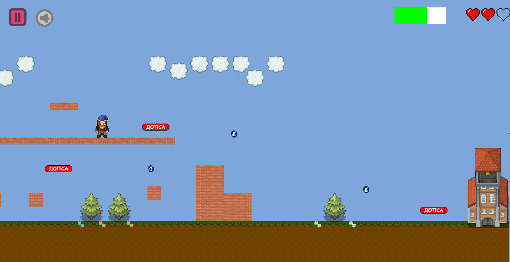
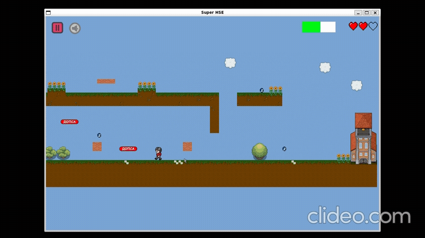
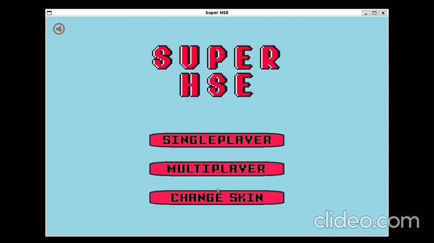
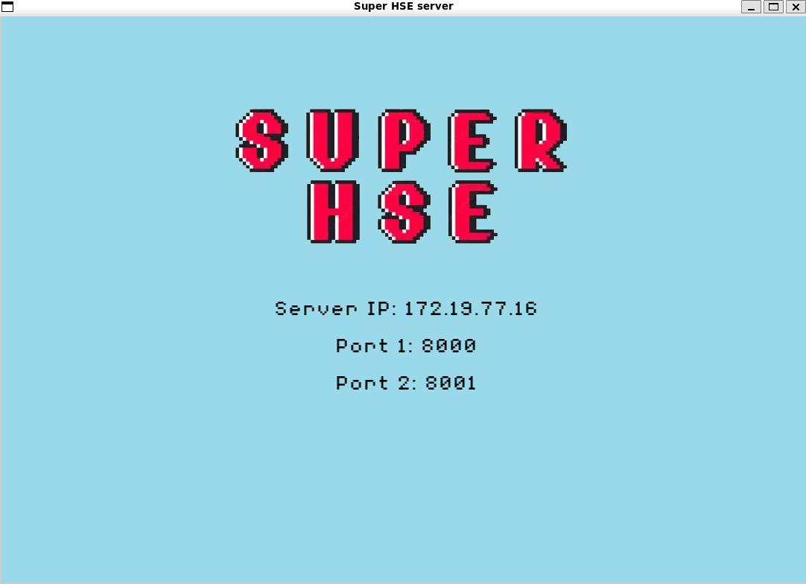

# SuperHSE

<p align="center">
    
</p>

### Описание


Super-HSE – это игра-платформер со стилизацией под НИУ ВШЭ СПб в виде десктопного приложения под Linux. В игре пользователю предложено пройти несколько уровней; в процессе прохождения можно собирать виртуальную валюту – монетки ВШЭ – которая используется для приобретения дополнительных "жизней" (или доступа к различным скинам). Помимо этого на каждом уровне встречаются враги - их нужно либо обойти, либо уничтожить, прыгнув сверху. У игры есть два режима – singleplayer, в котором игрок полностью самостоятельно проходит все уровни, и multiplayer, где два игрока могут проходить уровень вместе: очищать друг другу путь от врагов и собирать монетки, которые начисляются обоим игрокам.

Основной ход игры: после авторизации пользователь выбирает режим. При выборе singleplayer игрок попадает на карту уровней, где решаает, какой из доступных ему уровней он хочет сейчас проходить. При выборе режима multiplayer игрок попадает в окно подключения к серверу, игра начинается, как только подключились два игрока.

Управление персонажем осуществляется по клавишам `←` `↑` `↓` `→`.
___

### Превью




### Мультиплеер

В этом режиме два пользователеля подключаются по локальной сети и совместными усилиями проходят усложненный уровень.


### Восстановление

Если игрок потратил все жизни, то ему предоставляется покупка ИУПа, при приобретении которого игрок может продолжить прохождение текущего уровня.



### Магазин уникальных скинов

Игрок на заработанные деньги может приобрести дополнительные скины.



## Зависимости 

- SFML - библиотека для работы с графикой:

команда для установки
```
sudo apt-get install libsfml-dev
```

- SQLite3 - работа с базой данных:

команда для установки
```
sudo apt-get install sqlite3 libsqlite3-dev
```

- CryptoPP - шифрование данных 
    
Установить на wsl с помощью:
```
sudo apt-get install libcrypto++-dev libcrypto++-doc libcrypto++-utils
make
sudo make install
```

- LDtkLoader - парсинг файлов с уровнем

Скачать репозиторий: https://github.com/Madour/LDtkLoader и установить на wsl с помощью:

##### Build
```
mkdir build && cd build
cmake ../
cmake --build . 
```

##### Install

```
cmake ../
cmake --install . 
 ```

## Запуск игры
```
mkdir build && cd build

cmake ../ && make

./super_hse
```

#### Для запуска multiplayer

Один из двух игроков должен запустить у себя сервер, после чего каждый из двух игроков запускает обычное приложение super-hse

**Запуск сервера**
```
mkdir build && cd build

cmake ../ && make

./server
```
После чего появится окно, на котором высветится ip-адрес, по которому игрокам нужно подключаться в режиме multiplayer.



---

Перед запуском может понадобиться прогнать папку files через dos2unix с помощью команды 
```
find ./assets/files -type f -exec dos2unix {} \;
```
